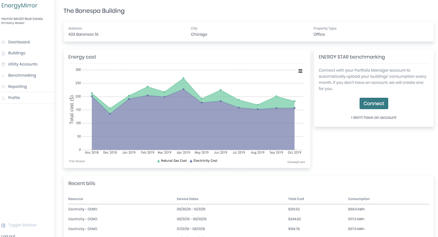

# EnergyMirror

EnergyMirror is a web application designed to help property managers, building owners and other commercial real estate stakeholders understand and manage their buildings' energy consumption, utility billing, and regulatory compliance.  The application is a work in progress and is far from completed.

Upon signing up, a user gets set up in three easy steps:
1. User grants EnergyMirror access to their utility accounts (UtilityAPI integration)
2. User creates their building(s) in EnergyMirror
3. User sets up the links between their buildings and the correct energy meters

Once the user completes these initial steps, EnergyMirror collects historical bill information and subscribes to any future bills.  The user can see a dashboard of any building's energy consumption and cost.

There are many more features that would turn this side project into a real business.  I have highlighted some of them below - I plan on chipping away at these features in the next few weeks.

## Try out a demo
[Try out EnergyMirror demo](https://energy-mirror.herokuapp.com/) by logging in as:
- Email: demo@energymirror.com
- Password: demouser1!

## Why is this out in the open?

Most of the code I have written in my career has been closed source.  This left me in a bit a of pickle when I started looking for my next position.  Many companies, and especially those with small teams or looking for remote work, asked for samples of code that I could share.  I didn't have much.  I created a packet with screenshots of the products I worked on with detailed descriptions of the products and technology stacks I had worked with - however, it didn't capture what I could bring to the table.

I needed to build a real web application and put it out in the open, so here it is!

## Future - going from a demo side project to a real product for real users

### Regulatory compliance

Many jurisdictions across the country (including the state of California and the city of New York) require that commercial buildings above a certain size report their energy consumption data yearly to the EPA's Energy Star program.  Energy Star uses a system called Portfolio Manager, through which property managers, building owners, or consultants enter building information to ensure compliance.

Portfolio Manager provides an API through which EnergyMirror can automatically upload energy bill information as soon as it is sent to the user.

Implementing this bridge to Energy Star's Portfolio Manager is a strong potential next step

### Energy savings project tracking

When a building goes through a large energy efficiency project, such as a lighting retrofit, energy consumption drops significantly.  The buildings paying for the proejcts want to visualize and verify those savings; the energy services providers want their customers to see the energy savings.

Allowing a user to create a project with a start date and visualize the difference is another potential feature

## Technology setup
### UtilityAPI

### Gems used
Below is a list of gems used.  One of the earliest goals when building this application was to set up a standard skeleton Rails 6 app from which to start any subsequent projects.  The list below represents my favored toolkit for a Rails app:

#### Authentication
- Devise

#### UI
- Bootstrap
- Stimulus
- React

#### Testing
- RSpec
- FactoryBot
- Shoulda Helpers
- Faker
- Pry

#### Asynchronous
- Sidekiq
- Redis

#### Miscellaneous
- Foreman
- Letter Opener
- Interactors
